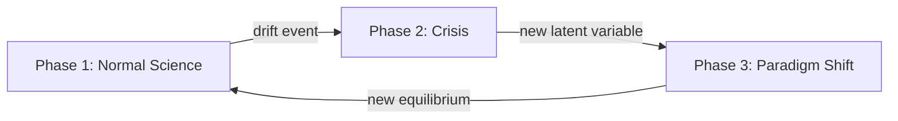
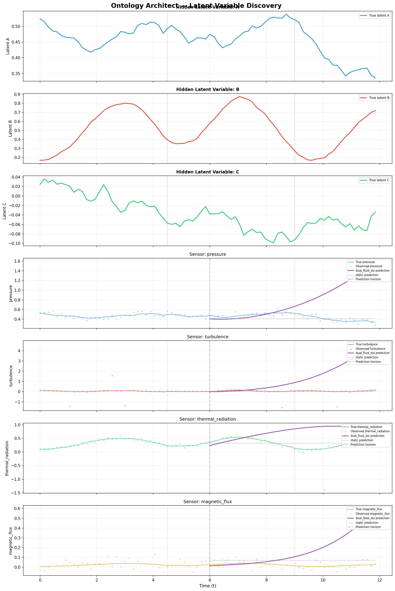
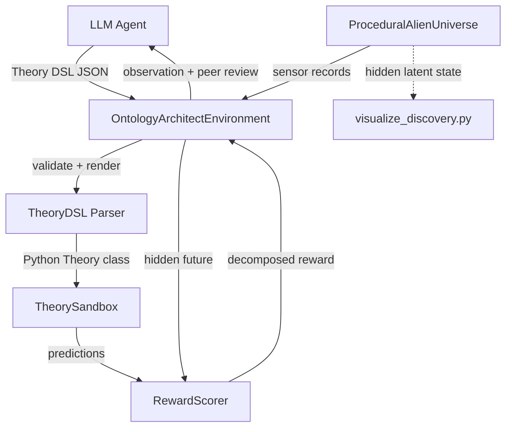

# 🔬 Ontology Architect

> **Train an LLM to discover hidden physical laws from raw sensor data.**

Ontology Architect is an OpenEnv-compatible RL environment that challenges LLM agents to perform *unsupervised scientific discovery*. An agent observes noisy sensor logs from a simulated alien universe governed by hidden ODEs and must iteratively write compact theories that predict future observations.

**→ [Colab Training Notebook](https://colab.research.google.com/github/rohan-27p/ontology_architect/blob/main/Alien_Physics_Discovery_OpenEnv.ipynb)**  
**→ [GitHub Repository](https://github.com/rohan-27p/ontology_architect)**  
**→ [HuggingFace Space](https://huggingface.co/spaces/lostdecimal27/ontology-architect)**

---

## The Challenge: Kuhnian Scientific Discovery

The environment implements a 3-phase discovery challenge inspired by Thomas Kuhn's *Structure of Scientific Revolutions*:



1. **Normal Science:** The agent sees 4 sensor channels (`pressure`, `turbulence`, `thermal_radiation`, `magnetic_flux`) and must discover that two hidden latent variables (A, B) drive all observations through coupled ODEs.
2. **Crisis:** The forcing frequency shifts — predictions break. The agent must detect the anomaly and adapt.
3. **Paradigm Shift:** A *third* latent variable (C) activates. The old 2-variable theory is fundamentally incomplete. The agent must discover this new ontological structure.

## How It Works

The agent submits a **structured Theory DSL** — a JSON spec defining latent state variables, dynamics equations, and observation projections. The environment:

1. Executes the theory in a secure sandbox
2. Compares predictions against hidden future observations
3. Scores using a composite reward: `log_likelihood - MDL_penalty + anomaly_bonus + drift_bonus + stability_bonus`
4. Returns peer review feedback showing where predictions diverged

### Theory DSL Example

```json
{
  "dsl_version": 1,
  "name": "dual fluid sketch",
  "state": ["A", "B"],
  "dynamics": {
    "A": {"linear": {"terms": {"A": -0.3, "B": 0.25}}},
    "B": {"add": [{"sin": "A"}, {"linear": {"terms": {"A": -0.08}}}]}
  },
  "observations": {
    "pressure": {"var": "A"},
    "turbulence": {"pow": [{"add": [{"var": "A"}, {"neg": {"var": "B"}}]}, 2]},
    "thermal_radiation": {"mul": [{"var": "B"}, {"exp": {"neg": {"abs": {"var": "A"}}}}]},
    "magnetic_flux": {"mul": [0.1, {"var": "A"}, {"var": "B"}]}
  },
  "integrator": {"dt": 0.15, "substeps": 2},
  "noise": 0.1
}
```

The DSL supports: `var`, `const`, `linear`, `add`, `mul`, `sin`, `cos`, `tanh`, `exp`, `abs`, `pow`, `sqrt`, `neg`.

## Reward Structure

| Component | Type | Signal |
|---|---|---|
| `r_prediction` | Dense | Gaussian log-likelihood on hidden future window |
| `r_complexity` | Dense | AST/DSL Minimum Description Length penalty |
| `r_anomaly` | Sparse | Bonus for detecting rare anomaly events |
| `r_drift` | Sparse | Bonus for adapting when hidden laws shift |
| `r_stability` | Dense | Rewards incremental refinement, penalizes wild oscillation |

## Results: Latent Variable Discovery

The following plot shows the environment running with the DSL oracle baseline (purple) vs a static persistence baseline (gray). The top rows show the *true hidden latent variables* (A, B, C) — which the agent never sees. The bottom rows show sensor predictions.



Key observations:
- **Latent A** exhibits autocatalytic damping — the oracle captures its trajectory
- **Latent B** is a forced oscillator driven by `sin(ω·t)` — after fixing the ODE bug, this now genuinely oscillates
- **Latent C** activates after the second drift event — the agent must discover this new dimension
- Red dashed lines mark drift events (hidden from the agent)

## Results: Agent Learning & Reward Curve

The environment evaluates agents by tracking their `total_reward` across episodes, directly capturing their ability to adapt to falsification. The generated reward curve below plots the performance of various baseline agents (Random, Heuristic, and Oracle) over time.


Key observations:
- **Phase Transitions**: Highlighted in shaded vertical regions (e.g., green for Normal Science, red for Crisis).
- **Falsification & Recovery**: When the alien physics undergo a paradigm shift, agents experience a sharp drop in reward (falsification) and must structurally refactor their theories to recover.
- **Theory Diversity**: The grader actively tracks structural distance between consecutive theories to ensure the agent is not stuck in a local minimum repeating the same flawed equations.

## How To Run

### Install Dependencies

```bash
uv sync                    # core deps
uv sync --extra dev        # + pytest
uv sync --extra train      # + transformers, torch, trl
```

### Run Tests

```bash
uv run pytest              # 27 tests — universe, sandbox, reward, DSL, dual_fluid
```

### Start the OpenEnv Server

```bash
uv run uvicorn server.app:app --reload
```

### Smoke Test (Dual-Fluid Universe)

```bash
uv run python -m ontology_architect.scripts.smoke \
  --config configs/dual_fluid_demo.json \
  --baseline dual_fluid_dsl \
  --steps 5
```

### Generate Discovery Visualization

```bash
uv run python -m ontology_architect.scripts.visualize_discovery \
  --config configs/dual_fluid_demo.json \
  --baseline dual_fluid_dsl \
  --compare-baseline static \
  --output artifacts/discovery_plot.png
```

### Training (Colab / GPU)

See the [Colab notebook](https://colab.research.google.com/github/rohan-27p/ontology_architect/blob/main/Alien_Physics_Discovery_OpenEnv.ipynb) for the full GRPO training pipeline:

```bash
# Oracle curriculum generation
uv run python -m ontology_architect.scripts.generate_curriculum \
  --config configs/dual_fluid_demo.json \
  --output artifacts/curriculum/oracle.jsonl \
  --episodes 60

# SFT warm-start
uv run python -m ontology_architect.scripts.train_sft \
  --config configs/dual_fluid_demo.json \
  --model-id <HF_MODEL_ID> \
  --data artifacts/curriculum/oracle.jsonl

# Group Reward Optimization
uv run python -m ontology_architect.scripts.train_gro \
  --config configs/dual_fluid_demo.json \
  --model-id <HF_MODEL_ID> \
  --group-size 2 \
  --max-steps 100
```

### Docker

```bash
docker build -t ontology_architect-env:latest -f server/Dockerfile .
docker run --rm -p 8000:8000 ontology_architect-env:latest
```

## Configuration

| Config | Purpose |
|---|---|
| `configs/tiny_smoke.json` | Fast local testing (thermal_split, 3 steps) |
| `configs/dual_fluid_demo.json` | **Demo showcase** (dual_fluid, 10 steps, paradigm shifts) |
| `configs/full_research.json` | Extended research benchmarks |

## Architecture



## Theory Module API (Python Mode)

For advanced agents, raw Python `Theory` classes are also supported:

```python
import math

class Theory:
    def fit(self, history):
        self.last = dict(history[-1]["sensors"]) if history else {}
        return {"records": len(history)}

    def predict(self, window):
        return [{"sensors": dict(self.last), "anomaly_prob": 0.05}
                for _ in range(window["steps"])]

    def log_prob(self, observations):
        return -float(len(observations))

    def describe(self):
        return "Static persistence theory."
```

## License

BSD-style license. See LICENSE file.
